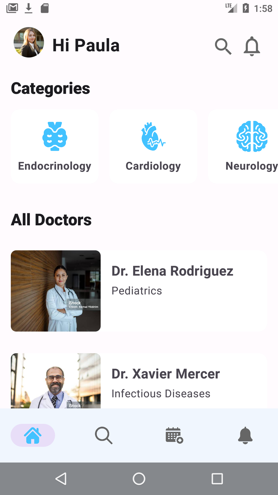
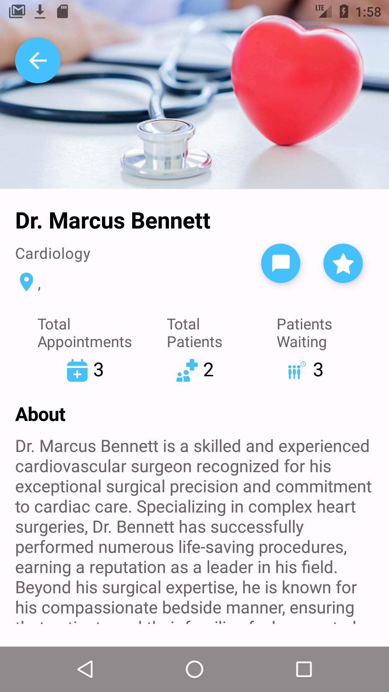

*Para ver a versão em português do readme, role a pagina para baixo.

<h1 align="center">App ConectaMedicina</h1>

  
  
   
  
  
  

  

English:

⭐ This is a project to demonstrate my ability in native Android development with Kotlin. More technical information below.

:hospital: conectaMedicina is an app for people that want to find doctors of all different specialties and schedule appointments. For that we give to the user the possibility of using a chat to talk directly with the doctor that he's interested in making an appointment with. The app has other cool features like realtime notifications.

 

## How it was made

This app was made using kotlin and jetpack compose. I used firebase fcm for the push notifications and websockets for the chat. I use a ktor and retrofit clients to talk to http routes that are in a server that I created.

## Main technologies used
- compose
- kotlin
- ktor
- retrofit
- ktor web sockets
- firebase fcm
- dagger hilt
- MVVM

Português:

⭐ Este é um projeto para demonstrar minha habilidade em desenvolvimento Android nativo com Kotlin. Mais informações técnicas abaixo.

:hospital: conectaMedicina é um aplicativo para pessoas que desejam encontrar médicos de diversas especialidades e agendar consultas. Para isso damos ao usuário a possibilidade de utilizar um chat para falar diretamente com o médico que tem interesse em marcar consulta. O aplicativo possui outros recursos interessantes, como notificações em tempo real.

 

## Como foi feito

Este aplicativo foi feito usando kotlin e jetpack compose. Usei firebase fcm para notificações push e websockets para o chat. Eu uso clientes ktor e retrofit para conversar com rotas http que estão em um servidor que criei.

## Principais tecnologias utilizadas
- compose
- kotlin
- ktor
- retrofit
- ktor web sockets
- firebase fcm
- dagger hilt
- MVVM
  

